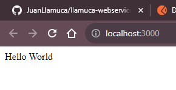

```
https://www.npmjs.com/package/express

verificar la version de node que tenemos
```
node -v
```


creamo un directorio llamada backend

- ejecutamos el comando npm init
"This utility will walk you through creating a package.json file.
It only covers the most common items, and tries to guess sensible defaults.

See `npm help init` for definitive documentation on these fields
and exactly what they do.

Use `npm install <pkg>` afterwards to install a package and
save it as a dependency in the package.json file.

Press ^C at any time to quit.
package name: (backend) hello
version: (1.0.0)                                                                                                                                                                                                  
description: web service that say Hello
entry point: (index.js)                                                                                                                                                                                           
test command:                                                                                                                                                                                                     
git repository:                                                                                                                                                                                                   
keywords:                                                                                                                                                                                                         
author: Llamuca                                                                                                                                                                                                   
license: (ISC)                                                                                                                                                                                                    
About to write to C:\Users\juanl\OneDrive\Documentos\Herramientas de desarrollo de software\Practica\llamuca-webservice\backend\package.json:

{
  "name": "hello",
  "version": "1.0.0",
  "description": "web service that say Hello",
  "main": "index.js",
  "scripts": {
    "test": "echo \"Error: no test specified\" && exit 1"
  },
  "author": "Llamuca",
  "license": "ISC"
}


Is this OK? (yes)
PS C:\Users\juanl\OneDrive\Documentos\Herramientas de desarrollo de software\Practica\llamuca-

"


-ejecutamos el comando npm i express en la consola para instalar express

```

- 
copiamos el codigo que se muestra en la pagina de npm 
const express = require('express')
const app = express()

app.get('/', function (req, res) {
  res.send('Hello World')
})

app.listen(3000)


- ejecutamos el comando node .\index.js

- Buscamos en el navegar localhost:3000

- Visualizamos en el navegador 


-- probamos que funcione http://localhost:3000/ en postman 

-- probamos que funcione http://localhost:3000/ping en postman 


------------------
sacar las extenciones de npm

npm i express

